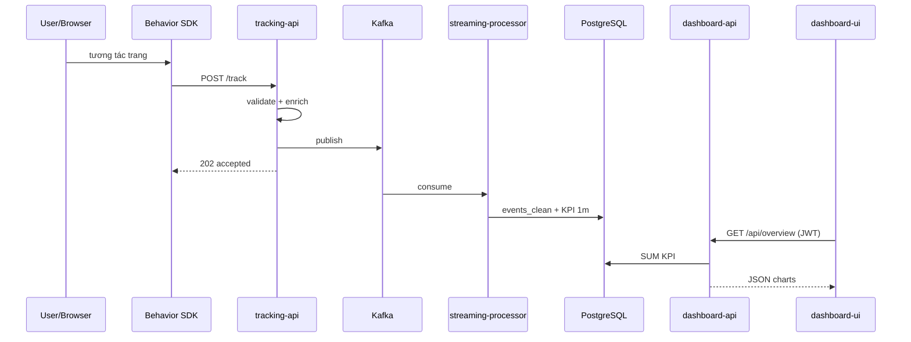

# Báo cáo chi tiết dự án — Business Data Streaming & Processing Pipeline

> Tài liệu **đầy đủ** cho báo cáo / luận văn / demo. Tham chiếu: [`SPEC.md`](SPEC.md) · [`RUNTIME.md`](RUNTIME.md) · [`TECH_STACK.md`](TECH_STACK.md) · [`API.md`](API.md).

---

## Mục lục

1. [Tóm tắt](#1-tóm-tắt-executive-summary)  
2. [Bối cảnh & mục tiêu](#2-bối-cảnh--mục-tiêu)  
3. [Kiến trúc tổng thể](#3-kiến-trúc-tổng-thể)  
4. [Luồng dữ liệu & schema event](#4-luồng-dữ-liệu--schema-event)  
5. [Thành phần phần mềm (chi tiết)](#5-thành-phần-phần-mềm-chi-tiết)  
6. [Streaming Processor](#6-streaming-processor)  
7. [Cơ sở dữ liệu PostgreSQL](#7-cơ-sở-dữ-liệu-postgresql)  
8. [Dashboard API & UI](#8-dashboard-api--ui)  
9. [Chatbot analytics (RAG)](#9-chatbot-analytics-rag)  
10. [Bảo mật](#10-bảo-mật)  
11. [Triển khai k3s & môi trường 2 laptop](#11-triển-khai-k3s--môi-trường-2-laptop)  
12. [Use case (UC) — mô tả triển khai](#12-use-case-uc--mô-tả-triển-khai)  
13. [Kiểm thử & demo](#13-kiểm-thử--demo)  
14. [Kết quả & số liệu mẫu](#14-kết-quả--số-liệu-mẫu)  
15. [Hạn chế & hướng phát triển](#15-hạn-chế--hướng-phát-triển)  
16. [Tài liệu tham chiếu](#16-tài-liệu-tham-chiếu)  
17. [Gợi ý cấu trúc báo cáo Word/PDF](#17-gợi-ý-cấu-trúc-báo-cáo-wordpdf)

---

## 1. Tóm tắt (Executive summary)

Dự án **refactor** pipeline xử lý dữ liệu kinh doanh demo cũ thành **hệ thống tracking & analytics realtime** cho website TMĐT:

| Trục | Mô tả |
|------|--------|
| **Input** | Hành vi trình duyệt (SDK) + sự kiện thương mại (đơn hàng, giỏ, thanh toán) |
| **Transport** | Kafka (`tracking_events_raw`); RabbitMQ cho commerce phía Lap2 |
| **Processing** | Python streaming: validate → clean → aggregate 1 phút → Postgres + insight Qdrant |
| **Serving** | REST API + React dashboard + chatbot tiếng Việt (RAG) |
| **Deploy** | k3s trên WSL2 (Laptop 1); web-shop trên Windows (Laptop 2) qua Tailscale/WSL IP |

**Điểm khác biệt so với hệ thống cũ:** trọng tâm **user behavior** và KPI TMĐT (phễu, SP, banner, search), không còn business event đơn lẻ; commerce **không** đi thẳng vào Kafka từ browser mà qua adapter có xác thực.

---

## 2. Bối cảnh & mục tiêu

### 2.1 Bối cảnh

- Repo gốc có generator API, Spark streaming, dashboard — phù hợp demo pipeline nhưng **schema và KPI** không phản ánh hành vi TMĐT.
- Yêu cầu mới: mô phỏng sản phẩm thật (web-shop), bot/người dùng tạo traffic, hiển thị realtime trên dashboard, hỏi đáp bằng AI **dựa trên số liệu thật** trong DB.

### 2.2 Mục tiêu chức năng

| ID | Mục tiêu | Tiêu chí đạt |
|----|----------|--------------|
| F1 | Thu thập event realtime | SDK + API nhận event &lt; 1s, trả 202 |
| F2 | Chuẩn hóa schema | behavior + commerce cùng format tracking |
| F3 | Lưu trữ & aggregate | Event sạch + KPI phút, idempotent khi restart |
| F4 | Trực quan hóa | Overview, funnel, SP, revenue, banner, search |
| F5 | Live feed | SSE event mới cho analyst |
| F6 | Chatbot | Câu hỏi NL → SQL aggregate + RAG, chặn PII |
| F7 | Vận hành demo | k3s, secret, 2 máy, tài liệu RUNTIME |

### 2.3 Phạm vi

**Trong phạm vi:** toàn bộ luồng trên, admin monitor pipeline, quản lý user dashboard, ingest có API key, lịch sử chat, kỳ analytics `minutes` / `date`, câu hỏi kép (compound).

**Ngoài phạm vi (ghi nhận):** API Gateway nginx tập trung, bot Playwright hoàn chỉnh, TLS production, multi-tenant, data lake/offline batch.

---

## 3. Kiến trúc tổng thể

### 3.1 Triển khai vật lý (2 laptop)

```text
┌──────────────────────── Laptop 2 (Windows) ────────────────────────────┐
│  clients/web-shop/          npm run dev → :3000                          │
│  sdk/browser-behavior-sdk/  gắn vào trang HTML                           │
│  tracking-adapter / worker  (tùy cấu hình) → RabbitMQ local hoặc Lap1   │
│                                                                          │
│  Env: TRACKING_FORWARD_URL=http://<WSL_IP>:31000/track                   │
│       TRACKING_INGEST_API_KEY=<secret>                                   │
│       COMMERCE_BACKEND_URL=http://<WSL_IP>:30330                         │
└───────────────────────────────┬──────────────────────────────────────────┘
                                │ Tailscale / LAN / WSL IP (không dùng localhost Lap2→API)
                                ▼
┌──────────────────────── Laptop 1 (WSL2 Ubuntu + k3s) ────────────────────┐
│  Namespace: realtime                                                     │
│  NodePort: 31000 tracking | 30330 commerce | 32000 dashboard-api         │
│            30809 dashboard-ui                                            │
│  ClusterIP: kafka, postgres, qdrant, ollama, rabbitmq                    │
└──────────────────────────────────────────────────────────────────────────┘
```

### 3.2 Sơ đồ thành phần logic

```text
                    ┌──────────────┐
                    │  Web-shop    │
                    │  + SDK       │
                    └──────┬───────┘
           POST /track      │      commerce events
                           ▼
              ┌────────────────────────┐
              │     tracking-api      │
              │  validate · enrich     │
              │  Kafka producer        │
              └───────────┬────────────┘
                          │ topic: tracking_events_raw
                          ▼
              ┌────────────────────────┐
              │  streaming-processor    │
              │  parse·validate·clean   │
              │  aggregate 1m           │
              └─┬────────────────────┬─┘
                ▼                    ▼
         ┌─────────────┐      ┌─────────────┐
         │ PostgreSQL  │      │   Qdrant    │
         │ events+KPI  │      │  insights   │
         └──────┬──────┘      └──────┬──────┘
                │                    │
                └────────┬───────────┘
                         ▼
              ┌────────────────────────┐
              │    dashboard-api      │◄── Ollama (LLM)
              └───────────┬────────────┘
                          ▼
              ┌────────────────────────┐
              │    dashboard-ui :30809    │
              └────────────────────────┘

  commerce-backend :30330 ──► RabbitMQ ──► adapter (Lap2) ──► ingest API
```

### 3.3 Design pattern

| Pattern | Áp dụng cụ thể |
|---------|----------------|
| Event-Driven | Mọi tương tác user → event JSON |
| Pub/Sub | Kafka consumer group streaming-processor |
| Pipeline | 6+ bước xử lý trong Python (mục 6) |
| Adapter | `business-event.mapper.js`: `order.completed` → `purchase_succeeded` |
| Layered API | `routes/` → `lib/` service → `db.js` / Kafka / Qdrant |
| RAG | Postgres (số) + Qdrant (ngữ cảnh) + Ollama (diễn đạt) |
| RBAC | JWT role: `super_admin`, `analyst`, `viewer` |

### 3.4 Pod / service k8s (sprint3)

Kustomize: `infra/k8s/sprint3` → gồm sprint2 + RabbitMQ + commerce-backend.

| Nhóm | Deployment (ví dụ) | Expose |
|------|-------------------|--------|
| Data | postgres, kafka, qdrant, rabbitmq | ClusterIP |
| Apps | tracking-api, streaming-processor, dashboard-api, dashboard-ui, commerce-backend, ollama | NodePort (một số) |

---

## 4. Luồng dữ liệu & schema event

### 4.1 Luồng behavior — từng bước

| Bước | Thành phần | Hành động | HTTP / ghi chú |
|------|------------|-----------|----------------|
| 1 | User | Click, xem SP, search | Trên web-shop |
| 2 | SDK | `track({ event_type, ... })` | Queue/batch gửi API |
| 3 | tracking-api | `validateTrackingEvent` | 400 nếu lỗi schema |
| 4 | tracking-api | `enrichEvent`: `event_id`, `timestamp`, `event_category` | Auto nếu thiếu |
| 5 | tracking-api | Kafka `send`, key = `session_id` | Partition theo session |
| 6 | API response | `202 { accepted, event_id }` | Không chờ streaming |
| 7 | streaming-processor | Consume → `tracking_events_clean` | `ON CONFLICT DO NOTHING` |
| 8 | Aggregator | Tumbling 1 phút | Flush định kỳ → bảng `*_kpi_1m` |
| 9 | insight_generator | Text insight → embed → Qdrant | Collection `pipeline_insights` |
| 10 | dashboard | Poll API / SSE | UI cập nhật |

### 4.2 Luồng commerce

| Bước | Mô tả |
|------|--------|
| 1 | `POST /api/orders` (commerce-backend) hoặc route `/commerce/*` |
| 2 | Publish message RabbitMQ (exchange/queue theo cấu hình web-shop) |
| 3 | Worker Lap2: consume → map canonical business event |
| 4 | `POST /api/ingest/business-events` + `Authorization: Bearer <TRACKING_INGEST_API_KEY>` |
| 5 | Dedup `event_id` in-memory (tracking-api) → Kafka → giống behavior |

**Lý do:** Browser không giữ credential RabbitMQ; ingest có khóa riêng, chỉ adapter tin cậy gọi được.

### 4.3 Schema tracking event (ingest)

| Trường | Bắt buộc | Ghi chú |
|--------|----------|---------|
| `event_id` | Khuyến nghị | API sinh `evt_<uuid>` nếu thiếu |
| `event_type` | Có | Xem bảng loại bên dưới |
| `anonymous_id` | Có | |
| `session_id` | Có | Kafka message key |
| `timestamp` | Khuyến nghị | ISO 8601; API điền `now` nếu thiếu |
| `event_source` | Tùy | `browser_sdk`, `rabbitmq_adapter`, … |
| `event_category` | Tùy | `behavior` \| `commerce`; suy từ `event_type` |
| `product_id`, `page_url`, `user_id` | Tùy | |
| `metadata` | Object | `query`, `amount`, `items[]`, `banner_id`, … |

**`event_type` — behavior:**  
`page_view`, `product_view`, `product_click`, `scroll_depth`, `search`, `filter_apply`, `banner_impression`, `banner_click`.

**`event_type` — commerce:**  
`add_to_cart`, `remove_from_cart`, `checkout_start`, `purchase_succeeded`, `payment_failed`, `cart_abandoned`, `order_cancelled`.

**`event_source` hợp lệ:**  
`browser_sdk`, `commerce_backend_rabbitmq`, `web_demo_backend`, `web_demo_worker`, `web_demo_api`, `rabbitmq_adapter`.

**Batch:** `POST /track/batch` — tối đa **100** event/request.

### 4.4 Schema business event (ingest)

| Trường | Ghi chú |
|--------|---------|
| `event_id`, `event_type`, `event_source`, `occurred_at`, `session_id` | Bắt buộc |
| `order_id` | Bắt buộc với `order.*`, `payment.*` |
| `metadata` | `total_amount`, `items`, `status`, … |

**Loại:** `order.created`, `order.completed`, `order.cancelled`, `payment.succeeded`, `payment.failed`, …  
Map sang tracking: ví dụ `order.completed` → `purchase_succeeded` trước khi vào Kafka.

### 4.5 Kafka

| Thuộc tính | Giá trị (repo) |
|------------|----------------|
| Topic | `tracking_events_raw` |
| Producer | tracking-api |
| Consumer group | streaming-processor |
| Key | `session_id` (giữ thứ tự theo phiên) |

### 4.6 Sequence (behavior) — mermaid



---

## 5. Thành phần phần mềm (chi tiết)

### 5.1 `sdk/browser-behavior-sdk/`

- Export `createBehaviorSdk(config)` — `endpoint`, `anonymousId`, `sessionId`.
- Tự gắn `event_source: browser_sdk`, `event_category: behavior`.
- Hỗ trợ flush batch, debounce (theo implementation SDK).

### 5.2 `services/tracking-api/`

| File / module | Vai trò |
|---------------|---------|
| `routes/track.js` | `POST /track`, `/track/batch` — **không** auth |
| `routes/ingest.js` | Business ingest + Bearer middleware |
| `tracking.validator.js` | Schema behavior/commerce |
| `lib/business-event.mapper.js` | Canonical → tracking payload |
| `lib/business-event.dedup.js` | Tránh ingest trùng `event_id` |
| `kafka.producer.js` | Gửi topic `tracking_events_raw` |
| `tracking.service.js` | `enrichEvent`, `ingestOne`, `ingestBatch` |

**Giới hạn body JSON:** 512 KB (`express.json`).

### 5.3 `services/commerce-backend/`

| Endpoint | Chức năng |
|----------|-----------|
| `POST /api/orders` | Tạo đơn → RabbitMQ `order.created` |
| `POST /api/orders/:code/cancel` | Hủy đơn |
| `POST /commerce/add-to-cart` | Shortcut publish commerce |
| `POST /commerce/checkout-start`, `/purchase`, … | Các giai đoạn phễu commerce |

**Không auth** — chỉ dùng demo nội bộ / mạng tin cậy.

### 5.4 `services/dashboard-api/`

| Vùng | Path code | Mô tả |
|------|-----------|--------|
| Auth | `routes/auth.js` | Login JWT, bcrypt, sync admin từ env khi start |
| Shop | `overview`, `funnel`, `products`, `revenue`, `search`, `banners`, `events` | Cần role analyst+ |
| Chat | `routes/chat.js`, `lib/chat/*` | Planner, RAG, Ollama |
| Admin | `routes/system.js`, `users.js` | Pipeline health, user CRUD |
| Period | `lib/period.js` | `minutes`, `date` UTC, `kpiPeriodFilter` |
| Zones | `lib/api-zones.js` | Tách router shop / chat / admin |

**SSE:** `GET /api/events/stream?token=<jwt>` — EventSource không gửi header Authorization.

**Event poller:** đọc `tracking_events_clean` mới → `eventBus` → push SSE.

### 5.5 `clients/dashboard/`

| Route | Trang | Nội dung chính |
|-------|-------|----------------|
| `/login` | LoginPage | Email/password → JWT localStorage |
| `/shop` | OverviewPage | KPI cards, trend, period pills + date picker |
| `/shop/revenue` | RevenuePage | Doanh thu, AOV, theo danh mục |
| `/shop/products` | ProductsPage | Top SP, anomaly (xem nhiều 0 mua) |
| `/shop/funnel` | FunnelPage | Phễu + drop-off |
| `/shop/events` | EventsPage | Bảng event gần đây + SSE |
| `/shop/search` | SearchPage | Top query, filter usage |
| `/shop/banners` | BannersPage | CTR banner |
| `/shop/chat` | ChatPage | Chat + sidebar lịch sử session |
| `/admin/system` | SystemPage | Health từng service, ingest trend |
| `/admin/users` | UsersPage | CRUD user |
| `/admin/setup` | AdminSetupPage | Port, env mẫu |
| `/admin/insights` | AdminInsightsPage | Insight Qdrant |

**Hook:** `useManagerPeriod` — đồng bộ `minutes` / `date` lên query API.

### 5.6 `clients/api-docs/`

- Swagger UI **riêng** port **5190** — không nhúng dashboard.
- Vite proxy `/proxy/dashboard|tracking|commerce` → WSL IP (tránh CORS).
- OpenAPI: `public/openapi.yaml`.

---

## 6. Streaming Processor

**Entry:** `services/streaming-processor/main.py`  
**Ngôn ngữ:** Python 3 (kafka-python, psycopg2).

### 6.1 Pipeline module

| Module | Chức năng |
|--------|-----------|
| `lib/parser.py` | Parse JSON Kafka message |
| `lib/validator.py` | Kiểm tra field tối thiểu |
| `lib/cleaner.py` | Chuẩn hóa timestamp, map field DB |
| `lib/aggregator.py` | Tumbling window **1 phút** — shop KPI, product KPI, banner, revenue |
| `lib/sink_postgres.py` | INSERT/UPSERT + `ON CONFLICT` |
| `lib/insight_generator.py` | Sinh câu insight → Qdrant |

### 6.2 Aggregator — logic nghiệp vụ

- **Shop (`tracking_kpi_1m`):** đếm `page_views`, `product_views`, `add_to_cart`, `remove_from_cart`, `purchases`, `revenue`, `unique_sessions` (session_id distinct trong phút), `conversion_rate`.
- **Product:** bảng `product_kpi_1m`, `product_revenue_kpi_1m` — revenue từ `metadata.amount` / `items[]`.
- **Banner:** `banner_kpi_1m` — impression/click, CTR.
- **Flush:** cửa sổ đóng + snapshot phút hiện tại — **`FLUSH_INTERVAL_SEC=5`** trên k8s (UPSERT KPI mỗi chu kỳ, không chờ hết phút).

### 6.3 Độ tin cậy

- **Idempotent:** `event_id` PK trên `tracking_events_clean`; KPI upsert theo `(window_start[, product_id|banner_id])`.
- **Restart:** consumer group tiếp tục offset; không nhân đôi event nếu đã ghi.

---

## 7. Cơ sở dữ liệu PostgreSQL

**DB:** `realtime` · **User:** `app` (demo) · **Deploy:** PVC + init ConfigMap `postgres-init-sql`.

### 7.1 `tracking_events_clean` (fact chi tiết)

| Cột | Kiểu | Mô tả |
|-----|------|--------|
| `event_id` | VARCHAR PK | Duy nhất toàn hệ thống |
| `event_time` | TIMESTAMP | Thời điểm event |
| `event_type`, `event_source`, `event_category` | VARCHAR | Phân loại |
| `anonymous_id`, `session_id`, `user_id` | VARCHAR | Định danh (nhạy cảm — chat chặn truy vấn) |
| `page_url`, `product_id` | TEXT/VARCHAR | Ngữ cảnh |
| `metadata` | JSONB | Linh hoạt (query search, amount, items) |
| `created_at` | TIMESTAMP | Lúc ghi DB |

### 7.2 `tracking_kpi_1m` (fact tổng hợp — phút)

| Cột | Ý nghĩa |
|-----|---------|
| `window_start`, `window_end` | PK = `window_start` |
| `page_views` … `purchases`, `remove_from_cart` | Counter phễu |
| `revenue` | Tổng tiền phút (VND demo) |
| `unique_sessions` | Số session phân biệt trong phút |
| `conversion_rate` | purchases / sessions (aggregate API tính lại khi SUM nhiều phút) |
| `processed_at` | Lần flush processor |

### 7.3 Các bảng KPI khác

- **`product_kpi_1m`:** PK `(window_start, product_id)` — views, cart, purchases, rates.
- **`product_revenue_kpi_1m`:** thêm `views`, `clicks`, `revenue`, `checkout_start`.
- **`banner_kpi_1m`:** PK `(window_start, banner_id)` — impressions, clicks, `ctr`.
- **`products_catalog`:** dimension SP — `name`, `price`, `category` (seed P001–P006 + sync từ web-shop).

### 7.4 Auth & chat

**`dashboard_users`:** `id` UUID, `email` unique, `password_hash` bcrypt, `role`, `is_active`.

**`chat_sessions`:** FK → `dashboard_users` ON DELETE CASCADE.  
**`chat_messages`:** FK → `chat_sessions`; `role` = `user` \| `assistant`; `meta` JSONB (intent, model).

### 7.5 Quan hệ (ER tóm tắt)

```text
dashboard_users 1───* chat_sessions 1───* chat_messages

tracking_events_clean  ──(logic)──►  *_kpi_1m  ◄──(LEFT JOIN)──  products_catalog
     (không FK)              product_id / window_start
```

**Thiết kế có chủ đích:** không FK event → catalog để streaming không fail khi SP mới chưa có trong catalog.

### 7.6 Migration

| File | Nội dung |
|------|----------|
| `001_tracking_schema.sql` | Bảng tracking + KPI |
| `002_products_catalog.sql` | Seed catalog |
| `003_dashboard_users.sql` | User + index |
| `004_chat_history.sql` | Chat FK |
| `005_remove_from_cart_kpi.sql` | Cột `remove_from_cart` trên KPI |

---

## 8. Dashboard API & UI

### 8.1 Port & URL

| Dịch vụ | NodePort | Ghi chú |
|---------|----------|---------|
| tracking-api | 31000 | SDK + ingest |
| commerce-backend | 30330 | |
| dashboard-api | 32000 | Dev Vite proxy `/api` |
| dashboard-ui | 30809 | Production UI nginx → API |

### 8.2 Bảng endpoint (dashboard-api)

| Method | Path | Role | Mô tả response |
|--------|------|------|----------------|
| POST | `/api/auth/login` | Public | `{ token, user }` |
| GET | `/api/auth/me` | JWT | Profile |
| PATCH | `/api/auth/change-password` | JWT | |
| GET | `/api/overview` | Shop | `kpi`, `trend`, `period` |
| GET | `/api/funnel` | Shop | `funnel[]` + drop_off_rate |
| GET | `/api/products/top` | Shop | `limit`, sort views |
| GET | `/api/products/anomalies` | Shop | views ≥ 5, purchases = 0 |
| GET | `/api/revenue/summary` | Shop | AOV, completion rate |
| GET | `/api/revenue/by-category` | Shop | |
| GET | `/api/banners` | Shop | + `source`, `diagnostics` |
| GET | `/api/search/top` | Shop | Từ `tracking_events_clean` |
| GET | `/api/search/filters` | Shop | `filter_apply` events |
| GET | `/api/events/recent` | Shop | Có `session_id` (analyst xem) |
| GET | `/api/events/stream` | JWT query | SSE |
| POST | `/api/chat` | Chat | `answer`, `intent`, `actions[]` |
| GET/POST/DELETE | `/api/chat/sessions*` | Chat | Lịch sử |
| GET | `/api/system/pipeline` | Admin | Health + metrics |
| GET | `/api/system/setup` | Admin | Port/env hints |
| GET | `/api/chat/insights` | Admin | Qdrant gần đây |
| GET/POST/PATCH/DELETE | `/api/users` | Admin | |

### 8.3 Tham số thời gian (`lib/period.js`)

| Query | Hành vi |
|-------|---------|
| `minutes=60` | Rolling 60 phút (`NOW() - interval`) |
| `minutes=0` hoặc `all` | Toàn bộ dữ liệu |
| `date=2026-05-30` | Một ngày UTC `[00:00, 24:00)` — **ưu tiên** hơn `minutes` |
| Max rolling | 43 200 phút (30 ngày) |

UI: period pills (15m, 30m, 1h, 24h, 7d, 30d, all) + **date picker** (`useManagerPeriod`).

---

## 9. Chatbot analytics (RAG)

### 9.1 Pipeline xử lý một câu hỏi

```text
message
  → classifyScope (deny | rewrite | allow)
  → buildPlanAsync (rule + optional LLM planner)
  → loadDataByPlan (tool.registry whitelist → SQL)
  → fetchRagHits (Qdrant, filter intent)
  → composeAnalystReport (template số liệu)
  → tryPolishAnswer (Ollama, timeout ~55s)
  → guardOutput (redact email, phone, session_id)
  → persistChatTurn (Postgres history)
  → buildActionCards (gợi ý hành động UI)
```

### 9.2 Intent (ví dụ)

Planner/rule map câu tiếng Việt → intent: `overview`, `revenue`, `funnel`, `top_products`, `product_anomaly`, `banners`, `search`, `insights`, `help`, `compound`, …

**Compound:** tách câu theo ` và `, `,`, `;` — gộp nhiều intent trong một lượt.

### 9.3 Tool whitelist (`tool.registry.js`)

Không cho LLM chạy SQL tùy ý. Chỉ các tool: `fetchOverview`, `fetchTopProducts`, `fetchFunnel`, `fetchBanners`, `fetchRevenueTrend`, `fetchTopSearches`, `searchInsights`, … — mỗi tool có `maxMinutes`, `maxLimit`.

### 9.4 Scope guard (bảo vệ PII)

Chặn từ khóa: email, phone, session_id, dump database, danh sách khách cụ thể, …  
**Rewrite:** câu hỏi dạng “user nào mua” → chuyển sang funnel/revenue aggregate.

### 9.5 Qdrant & Ollama

| Thành phần | Cấu hình |
|------------|----------|
| Collection | `pipeline_insights` (env `QDRANT_COLLECTION`) |
| Embedding | Hash-based 384-d (không OpenAI API) |
| Ollama | Model `qwen2.5:3b`, PVC `ollama-data` 10Gi |
| Polish | Temperature/throttle riêng `CHAT_POLISH_*` |

---

## 10. Bảo mật

### 10.1 Ma trận

| Tài sản | Biện pháp | Ghi chú demo |
|---------|-----------|--------------|
| Dashboard API | JWT HS256, expiry `JWT_EXPIRES` | |
| Mật khẩu user | bcrypt | Sync admin từ secret k8s |
| Ingest | Bearer `TRACKING_INGEST_API_KEY` | 401 nếu sai |
| `/track` | Chỉ validation | Có thể spam nếu lộ URL |
| Postgres | ClusterIP + secret | Không NodePort |
| Chat | Scope + output guard | Không thay thế anonymize DB |
| CORS dashboard | `CORS_ORIGIN_DASHBOARD` | Vite dev + UI :30809 |

### 10.2 Phân quyền

| Role | `/shop` | `/admin` | Chat |
|------|---------|----------|------|
| `analyst` | Có | Không | Có |
| `viewer` | Có (legacy) | Không | Có |
| `super_admin` | Có | Có | Có |

### 10.3 Secret k8s (`app-secrets`)

`POSTGRES_*`, `JWT_SECRET`, `DASHBOARD_ADMIN_*`, `RABBITMQ_*`, `TRACKING_INGEST_API_KEY`, … — tạo một lần theo `RUNTIME.md` §4.

---

## 11. Triển khai k3s & môi trường 2 laptop

### 11.1 Cài đặt Laptop 1 (tóm tắt)

```bash
git clone <repo> && cd Business-Data-Streaming---Processing-Pipeline
cp infra/.env.example infra/.env   # WSL_IP, mật khẩu
bash infra/k8s/install-k3s-wsl.sh
# secret + deploy — xem RUNTIME.md §4
bash infra/k8s/import-images.sh
k3s kubectl apply -k infra/k8s/sprint3
k3s kubectl -n realtime get pods   # nếu 0/0: scale deploy --all --replicas=1 (RUNTIME.md § tắt tải)
k3s kubectl -n realtime exec deploy/ollama -- ollama pull qwen2.5:3b
```

### 11.2 Laptop 2

```bash
cd clients/web-shop
# .env: TRACKING_FORWARD_URL, TRACKING_INGEST_API_KEY, COMMERCE_BACKEND_URL
npm install && npm run dev
# optional: npm run worker  (adapter → ingest)
```

### 11.3 Biến môi trường quan trọng (`infra/.env`)

| Biến | Mục đích |
|------|----------|
| `WSL_IP` | IP WSL cho Lap2 và Vite |
| `VITE_DASHBOARD_API_URL` | Build/proxy dashboard |
| `VITE_TRACKING_API_URL` | SDK config |
| `POSTGRES_*` | Local dev dashboard-api |
| `JWT_SECRET`, `DASHBOARD_ADMIN_*` | Auth |
| `TRACKING_INGEST_API_KEY` | Khớp tracking-api secret |

### 11.4 Sau khi đổi code

```bash
bash infra/k8s/rebuild-all-dev-images.sh
k3s kubectl -n realtime rollout restart deployment/dashboard-api deployment/dashboard-ui deployment/tracking-api deployment/streaming-processor
```

---

## 12. Use case (UC) — mô tả triển khai

### UC12 — Vận hành & giám sát pipeline (Admin)

| Bước | Actor | Hệ thống |
|------|-------|----------|
| 1 | Admin | Login `super_admin` → `/admin/system` |
| 2 | Hệ thống | `GET /api/system/pipeline` — probe tracking-api, commerce, streaming lag, Qdrant, Ollama |
| 3 | Admin | Xem `events_last_5m`, `last_kpi_flush`, ingest trend |
| 4 | Admin | (Tùy chọn) Headlamp/kubectl — script `infra/k8s/ops/kubernetes-dashboard/` |

**Bằ chứng:** screenshot Pipeline Monitor + `kubectl get pods -n realtime`.

### UC13 — Thu thập behavior (`/track`)

| Bước | Mô tả |
|------|--------|
| 1 | SDK gửi JSON hợp lệ |
| 2 | API validate → 400 hoặc 202 |
| 3 | Kafka nhận message |
| 4 | Processor ghi `tracking_events_clean` |
| 5 | Dashboard Events/SSE hiển thị |

### UC14 — Ingest commerce

| Bước | Mô tả |
|------|--------|
| 1 | Đặt hàng trên web-shop |
| 2 | Event vào RabbitMQ |
| 3 | Adapter POST ingest + Bearer |
| 4 | `event_category=commerce` trong DB |
| 5 | KPI purchases/revenue tăng |

### UC20 — Chatbot analytics

| Bước | Mô tả |
|------|--------|
| 1 | Analyst hỏi tiếng Việt trên `/shop/chat` |
| 2 | API planner + SQL + RAG |
| 3 | Trả lời markdown + action cards |
| 4 | Lưu session — xem lại sidebar |

**Câu hỏi mẫu:** “Doanh thu 1 giờ qua?”, “Top sản phẩm?”, “Phễu chuyển đổi hôm nay?”, “Doanh thu và top SP” (compound).

---

## 13. Kiểm thử & demo

### 13.1 Kiểm thử thủ công

| # | Việc | Kỳ vọng |
|---|------|---------|
| 1 | `GET :32000/health` | postgres ok |
| 2 | Login dashboard | 200 + token |
| 3 | Swagger `:5190` login qua `/proxy/dashboard` | 200 (WSL IP trong proxy) |
| 4 | `POST :31000/track` event mẫu | 202 |
| 5 | Đợi ~1–2 phút | Overview KPI tăng |
| 6 | Chat “doanh thu 60 phút” | Số khớp API overview |
| 7 | Admin pipeline | services status |

### 13.2 Kiểm thử tự động (repo)

| Lệnh | Phạm vi |
|------|---------|
| `npm test` (dashboard-api) | chat guards, planner, period, compound |
| `npm run test:eval` | Bộ câu hỏi chat `eval/questions.json` |
| tracking-api tests | validator, business ingest |

### 13.3 Truy vấn DB (debug)

```bash
k3s kubectl -n realtime exec -it deploy/postgres -- psql -U app -d realtime
\dt
SELECT COUNT(*) FROM tracking_events_clean;
SELECT * FROM tracking_kpi_1m ORDER BY window_start DESC LIMIT 5;
```

---

## 14. Kết quả & số liệu mẫu

Trên môi trường demo đã chạy thực tế (có thể thay đổi theo traffic):

| Chỉ số | Ví dụ đã quan sát |
|--------|-------------------|
| `tracking_events_clean` | Hàng nghìn dòng |
| `tracking_kpi_1m` | Hàng chục cửa sổ phút |
| `products_catalog` | Seed + SP từ web-shop (100+ dòng) |
| Users | `admin@gmail.com` (super_admin), analyst test |
| Chat | Session lưu Postgres, 10+ messages |

**Luồng E2E chứng minh:** web-shop → track → Kafka → KPI → biểu đồ dashboard → chatbot trích cùng số liệu.

---

## 15. Hạn chế & hướng phát triển

| # | Hạn chế | Hướng xử lý |
|---|---------|-------------|
| 1 | `/track` public | API key / HMAC SDK |
| 2 | HTTP NodePort | Ingress + TLS |
| 3 | Một DB user `app` | Role read-only cho dashboard |
| 4 | KPI SUM nhiều phút ≠ unique user thật | Metric cardinality / HyperLogLog |
| 5 | Ollama 3B CPU chậm | Model lớn hơn / GPU |
| 6 | Không FK tracking-catalog | Chuẩn hóa product_id |
| 7 | Bot simulator shell | Playwright kịch bản mua hàng |

---

## 16. Tài liệu tham chiếu

| File | Nội dung |
|------|----------|
| [`BAO_CAO_DU_AN.md`](BAO_CAO_DU_AN.md) | File này — báo cáo chi tiết |
| [`SPEC.md`](SPEC.md) | Spec gốc đầy đủ |
| [`RUNTIME.md`](RUNTIME.md) | Deploy, lỗi thường gặp |
| [`TECH_STACK.md`](TECH_STACK.md) | Luồng + stack diagram |
| [`REPO_MAP.md`](REPO_MAP.md) | Map path |
| [`API.md`](API.md) | REST reference |
| [`RUNTIME.md`](RUNTIME.md) | Deploy, port §5, CI/CD §14, Postgres §15 |
| [`TECH_STACK.md`](TECH_STACK.md) | Luồng + stack |
| [`API.md`](API.md) | REST + Swagger :5190 |

---

## 17. Gợi ý cấu trúc báo cáo Word/PDF

| Chương LUẬN VĂN | Lấy từ mục |
|-----------------|------------|
| Chương 1 — Giới thiệu | §1, §2 |
| Chương 2 — Cơ sở lý thuyết | §3.3 (pattern), tham khảo EDA, RAG |
| Chương 3 — Phân tích & thiết kế | §3, §4, §7 (ER), §8 |
| Chương 4 — Cài đặt | §5, §6, §11 |
| Chương 5 — Thử nghiệm | §12, §13, §14 + hình screenshot |
| Chương 6 — Chatbot / AI | §9 |
| Chương 7 — Kết luận | §15 |

**Hình nên chụp:** sơ đồ kiến trúc (§3.2), màn Overview, Funnel, Chat, Admin Pipeline, Swagger login 200, `\dt` Postgres.

---

*Tài liệu đồng bộ với codebase tại thời điểm viết. Tên topic `tracking_events_raw`, bảng KPI, port NodePort — lấy từ `SPEC.md` / `RUNTIME.md` §5, không tự đặt tên mới.*
