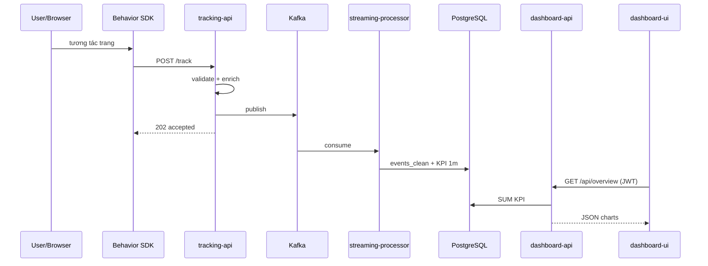

# Báo cáo chi tiết dự án — Business Data Streaming & Processing Pipeline

> **LEGACY V1:** Tài liệu này mô tả pipeline/k3s cũ đã ngừng duy trì ngày 2026-08-24. Các đường dẫn cũ chỉ dùng tham khảo; xem `REPOSITORY_LAYOUT.md` cho cấu trúc hiện hành.

> Tài liệu **đầy đủ** cho báo cáo / luận văn / demo.  
> **Chưa nắm hệ thống?** Đọc **[mục 0](#0-hiểu-hệ-thống-trước-đọc-phần-này-trước)** trước. Các mục §1–§15 viết theo cùng phong cách: **kể chuyện + ví dụ**; bảng/schema chi tiết nằm ở **[Phụ lục A–E](PHU_LUC.md)** hoặc [`API.md`](API.md).

---

## Mục lục

0. **[Hiểu hệ thống trước](#0-hiểu-hệ-thống-trước-đọc-phần-này-trước)** ← bắt đầu tại đây  
1. [Tóm tắt](#1-tóm-tắt-executive-summary)  
2. [Bối cảnh & mục tiêu](#2-bối-cảnh--mục-tiêu)  
3. [Kiến trúc tổng thể](#3-kiến-trúc-tổng-thể)  
4. [Luồng dữ liệu & schema event](#4-luồng-dữ-liệu--schema-event)  
5. [Thành phần phần mềm (chi tiết)](#5-thành-phần-phần-mềm-chi-tiết)  
6. [Streaming Processor](#6-streaming-processor)  
7. [Cơ sở dữ liệu PostgreSQL](#7-cơ-sở-dữ-liệu-postgresql)  
8. [Dashboard API & UI](#8-dashboard-api--ui)  
9. [Chatbot analytics (RAG)](#9-chatbot-analytics-rag)  
10. [Bảo mật](#10-bảo-mật)  
11. [Triển khai k3s & môi trường 2 laptop](#11-triển-khai-k3s--môi-trường-2-laptop)  
12. [Use case (UC) — mô tả triển khai](#12-use-case-uc--mô-tả-triển-khai)  
13. [Kiểm thử & demo](#13-kiểm-thử--demo)  
14. [Kết quả & số liệu mẫu](#14-kết-quả--số-liệu-mẫu)  
15. [Hạn chế & hướng phát triển](#15-hạn-chế--hướng-phát-triển)  
16. [Tài liệu tham chiếu](#16-tài-liệu-tham-chiếu)  
17. [Gợi ý cấu trúc báo cáo Word/PDF](#17-gợi-ý-cấu-trúc-báo-cáo-wordpdf)  
— **[Phụ lục A–E](PHU_LUC.md)** (schema, API, cây thư mục, checklist, ảnh/log)

---

## 0. Hiểu hệ thống trước (đọc phần này trước)

### Hệ thống này làm gì? (một câu)

**Ghi lại mọi hành động trên web-shop (xem, click, mua…), xử lý thành số liệu theo phút, rồi hiển thị trên dashboard và cho chatbot trả lời dựa trên số thật trong database.**

Không phải “web bán hàng” — web-shop chỉ là nơi phát sinh dữ liệu. Phần lõi là **pipeline analytics realtime** chạy trên Laptop 1 (k3s).

---

### Hai máy — ai làm việc gì?

| Máy | Vai trò dễ nhớ | Chạy gì |
|-----|------------------|---------|
| **Laptop 2 (Windows)** | Cửa hàng + khách | Web TMĐT (`../Simulate_Demo`), SDK gửi hành vi, worker/adapter xử lý đơn hàng |
| **Laptop 1 (WSL + k3s)** | Nhà máy số liệu | Nhận event, Kafka, xử lý, Postgres, dashboard, chatbot |

Laptop 2 **không** tính KPI phức tạp. Laptop 1 **không** hiển thị giao diện shop cho khách. Hai máy nối nhau qua **WSL IP** hoặc **Tailscale** (`lap1`).

---

### Hai loại dữ liệu (đừng trộn)

| Loại | Ví dụ | Ai gửi | Đi đường nào (tóm tắt) |
|------|--------|--------|-------------------------|
| **Behavior** (hành vi) | Xem trang, click SP, search | SDK trên trình duyệt | Web-shop → `POST /track` → Kafka → xử lý → Postgres |
| **Commerce** (mua bán) | Tạo đơn, thanh toán, hủy đơn | Backend shop / commerce-api | RabbitMQ → worker → **adapter** → ingest có mật khẩu → Kafka → cùng pipeline behavior |

Cả hai loại cuối cùng **gộp một topic Kafka** (`tracking_events_raw`) để dashboard nhìn **một nguồn sự thật**.

---

### Một câu chuyện từ đầu đến cuối

**Kịch bản A — Khách chỉ xem sản phẩm**

1. Bạn mở web-shop trên Lap2 (`localhost:3000`).
2. SDK ghi: “vừa `page_view` / `product_view`”.
3. Gói JSON gửi tới Lap1: `http://<WSL_IP>:31000/track`.
4. `tracking-api` kiểm tra hợp lệ → bỏ vào **Kafka** (hàng chờ trung tâm).
5. `streaming-processor` (Python) đọc Kafka → lưu event sạch + cộng KPI phút (view, session…).
6. Mở dashboard Lap1 `:30809` → trang Overview / Events thấy số và event mới (vài giây sau).

**Kịch bản B — Khách mua hàng (thêm bước đơn hàng)**

1. Checkout trên web-shop → backend tạo đơn, bắn message **RabbitMQ** (`order.created`, …).
2. **Worker** Lap2 xử lý đơn (giả lập kho/thanh toán) → sinh `order.completed`.
3. **Adapter** Lap2 đọc queue → gọi `POST /api/ingest/business-events` (có **API key**).
4. Từ đây **giống kịch bản A**: Kafka → streaming → Postgres → dashboard **Revenue** tăng.

**Điểm cần nhớ:** mua hàng **không** nhảy thẳng từ trình duyệt vào Kafka — phải qua RabbitMQ + adapter để an toàn và giống TMĐT thật.

---

### Năm “hộp” trong đầu (thay vì nhớ 15 công nghệ)

```text
[1 Thu thập]  web-shop + SDK / adapter
      ↓
[2 Hàng chờ]  Kafka (tracking_events_raw)
      ↓
[3 Xử lý]     streaming-processor (làm sạch + KPI/phút)
      ↓
[4 Kho số]    PostgreSQL (+ Qdrant cho câu insight chat)
      ↓
[5 Hiển thị]  dashboard-ui + chatbot (đọc qua dashboard-api)
```

- **RabbitMQ** chỉ xuất hiện **trước hộp [2]** cho luồng commerce (Lap2), không thay Kafka.
- **Ollama** chỉ giúp chat **nói cho mượt**; số vẫn lấy từ Postgres.

---

### Ba câu hỏi hay gặp khi đọc doc

**“Tại sao cần Kafka, không ghi thẳng DB?”**  
Vì API phải trả lời nhanh (`202`). Kafka giữ event khi processor tạm chậm/restart — không mất dữ liệu giữa chừng.

**“Dashboard lấy số ở đâu?”**  
**PostgreSQL** (bảng KPI phút). Chatbot cũng query SQL đó — nên câu trả lời và chart **cùng nguồn**.

**“MongoDB ở đâu?”**  
Chỉ trên **web-shop Lap2** (sản phẩm, giỏ, user shop). **Analytics** nằm hết trên Postgres Lap1.

---

### Đọc tiếp theo thứ tự nào?

| Bạn muốn | Đọc mục |
|----------|---------|
| Nắm kiến trúc + sơ đồ | [§3 Kiến trúc](#3-kiến-trúc-tổng-thể) |
| Hiểu từng bước event / field | [§4 Luồng dữ liệu](#4-luồng-dữ-liệu--schema-event) |
| Tại sao chọn Kafka, Python, không Spark… | [§2.4 Công nghệ](#24-giải-thích-công-nghệ--tại-sao-chọn-cái-này-không-chọn-cái-khác) |
| Cài và chạy demo | [`RUNTIME.md`](RUNTIME.md) |
| API / Swagger | [`API.md`](API.md) |

Chi tiết kỹ thuật (mục 5–9) đọc **sau** khi đã hình dung được 5 hộp ở trên.

---

## 1. Tóm tắt (Executive summary)

Dự án **đổi mới** pipeline demo cũ thành hệ thống **ghi hành vi + đơn hàng TMĐT theo thời gian thực**, rồi cho analyst xem biểu đồ và hỏi chatbot bằng tiếng Việt.

**Luồng một câu:** web-shop phát sinh event → Kafka → Python gom KPI theo phút → Postgres → dashboard & chat.

**Khác bản cũ ở đâu:** không còn Spark nặng laptop; KPI đúng ngữ cảnh TMĐT (phễu, SP, banner, revenue); commerce **không** nhét thẳng từ browser vào Kafka mà qua RabbitMQ + adapter + API key.

**Triển khai demo:** Laptop 1 (k3s) chạy “nhà máy số liệu”; Laptop 2 (Windows) chạy web-shop + worker/adapter.

---

## 2. Bối cảnh & mục tiêu

### 2.1 Vì sao làm lại?

Repo ban đầu chứng minh được “có pipeline” (API → Kafka → xử lý → dashboard) nhưng **số liệu không giống TMĐT thật** — thiếu phễu xem–giỏ–mua, thiếu doanh thu theo phút, chat dễ lệch số.

Yêu cầu mới: có **web-shop giống cửa hàng thật**, traffic từ người/bot, dashboard nhích sau vài giây, chatbot **chỉ nói dựa trên DB** chứ không tự bịa.

### 2.2 Hệ thống phải làm được gì? (kể bằng ví dụ)

- **F1 — Ghi event nhanh:** SDK bắn `product_view` → API trả `202` ngay, không làm web lag.
- **F2 — Một ngôn ngữ event:** Hành vi (`page_view`) và mua hàng (`purchase_succeeded`) cùng format để một pipeline xử lý.
- **F3 — Không mất số khi restart:** Processor tắt bật lại vẫn đọc tiếp Kafka; KPI upsert, không nhân đôi event.
- **F4 — Dashboard đủ “bán hàng”:** Overview, phễu, SP, banner, search, revenue — không chỉ một chart chung.
- **F5 — Thấy event sống:** Trang Events/SSE thấy click mới sau vài giây.
- **F6 — Chat hỏi tiếng Việt:** “Doanh thu 1 giờ?” → SQL lấy số → RAG bối cảnh → trả lời; chặn hỏi email/phone/session cụ thể.
- **F7 — Demo 2 laptop:** Lap1 k3s + Lap2 web-shop, có tài liệu chạy (`RUNTIME.md`).

### 2.3 Làm tới đâu, không làm tới đâu

**Có trong đồ án:** ingest có key, admin xem pipeline, quản lý user, lịch sử chat, chọn kỳ `15p/1h/7 ngày` hoặc **một ngày** (`date`), câu hỏi ghép (compound).

**Không làm (ghi nhận):** gateway nginx production, bot Playwright hoàn chỉnh, TLS/multi-tenant, data lake batch lớn.

### 2.4 Giải thích công nghệ — tại sao chọn cái này, không chọn cái khác

Mỗi mục gồm: **là gì** → **điểm nổi bật (so với phương án khác)** → **ví dụ trong project**.

---

**Node.js + Express** — runtime và framework viết API bằng JavaScript phía server.

- **Điểm nổi bật:** Thay vì Java Spring hay .NET (nặng, setup lâu cho demo), Node cho phép dựng nhanh nhiều micro-service nhỏ (`tracking-api`, `dashboard-api`, `commerce-backend`) trên cùng một stack, xử lý I/O tốt khi vừa nhận HTTP vừa gọi Kafka/Postgres.
- **Ví dụ:** `POST /track` nhận event từ SDK → validate trong vài ms → publish Kafka → trả `202` ngay, không chặn user trên web-shop.

---

**JWT + bcrypt** — đăng nhập không cần lưu session trên server từng request.

- **Điểm nổi bật:** Thay vì session Redis (thêm một service) hoặc cookie phức tạp, JWT gắn role (`super_admin`, `analyst`) vào token; bcrypt đảm bảo mật khẩu trong DB không lộ plaintext — đủ cho demo bảo mật mà vẫn dễ triển khai trên k3s.
- **Ví dụ:** Login `admin@gmail.com` → token → gọi `/api/overview` và `/admin/system` với quyền khác nhau.

---

**Kafka** — hàng đợi sự kiện dạng log, nhiều consumer đọc cùng topic, có offset.

- **Điểm nổi bật:** Thay vì ghi thẳng từ API vào Postgres (API chậm khi DB nặng) hoặc Redis Pub/Sub (mất message khi restart, khó replay), Kafka **tách ingest và xử lý**: API chỉ publish, `streaming-processor` đọc sau; restart processor vẫn đọc tiếp offset — phù hợp pipeline realtime và báo cáo event-driven.
- **Ví dụ:** Cả `page_view` (SDK) và `purchase_succeeded` (commerce) cùng topic `tracking_events_raw` → một luồng KPI thống nhất.

---

**RabbitMQ** — message broker kiểu hàng đợi + routing (exchange/queue).

- **Điểm nổi bật:** Commerce không đẩy thẳng vào Kafka từ browser vì **không an toàn** (lộ queue, không kiểm soát). RabbitMQ + worker + adapter mô phỏng TMĐT thật: đơn hàng xử lý bất đồng bộ (`order.created` → worker → `order.completed`), adapter mới gọi ingest có **API key**. Dùng Kafka cho bước này cũng được nhưng RabbitMQ quen thuộc hơn với pattern “order queue + worker” trên web-shop Lap2.
- **Ví dụ:** Checkout Lap2 → RabbitMQ → `npm run adapter` → `POST /api/ingest/business-events` (Bearer key) → Kafka.

---

**Python streaming-processor** (thay Spark cũ) — job đọc Kafka, transform, ghi DB.

- **Điểm nổi bật:** Repo gốc dùng **Spark** — mạnh batch lớn nhưng **nặng RAM/CPU**, khó chạy ổn trên laptop WSL demo. Python + `kafka-python` đủ cho throughput demo, code pipeline (`parser` → `aggregator` → `sink_postgres`) **đọc được trong báo cáo**, deploy một container k3s, không cần cluster Spark.
- **Ví dụ:** Event vào → `tracking_events_clean` + upsert `tracking_kpi_1m` mỗi `FLUSH_INTERVAL_SEC=5` giây.

---

**Tumbling window 1 phút** — gom KPI theo từng phút cố định (10:01–10:02), không trượt.

- **Điểm nổi bật:** Thay vì chỉ đếm “tổng từ trước đến giờ” (khó so sánh theo thời gian) hoặc sliding window phức tạp, tumbling 1 phút **dễ giải thích** trên dashboard (“phút này bao nhiêu view/cart”) và khớp bảng `*_kpi_1m`.
- **Ví dụ:** Trong phút hiện tại, mỗi lần flush cộng dồn `add_to_cart`, `revenue` — UI thấy nhích sau ~5–10 giây.

---

**PostgreSQL** — database quan hệ, truy vấn SQL.

- **Điểm nổi bật:** MongoDB web-shop Lap2 giữ **dữ liệu shop** (sản phẩm, giỏ); analytics cần **JOIN, SUM, GROUP BY** theo phút/sản phẩm — Postgres làm tốt và **số chatbot = số dashboard** (cùng nguồn SQL). Thay vì đưa analytics vào Mongo (aggregate pipeline khó đọc) hoặc Elasticsearch (overkill cho demo).
- **Ví dụ:** `GET /api/revenue` và chat “doanh thu 1 giờ qua” đều query `product_revenue_kpi_1m` / KPI tables.

---

**Qdrant** — lưu vector, tìm đoạn text “gần nghĩa”.

- **Điểm nổi bật:** Postgres lưu số; không lưu tốt “insight dạng câu” để chat hỏi mơ hồ (“sản phẩm nào lạ”). Qdrant + embedding 384-d (không cần OpenAI) bổ sung **ngữ cảnh RAG** mà không nhét full text vào prompt. Thay vì chỉ keyword search (miss câu diễn đạt khác).
- **Ví dụ:** `insight_generator` ghi “SP X view cao, mua thấp” → chat hỏi tương tự → retrieve từ `pipeline_insights`.

---

**RAG + Ollama** — trả lời AI nhưng bám dữ liệu thật; LLM chạy local.

- **Điểm nổi bật:** Chat **thuần GPT/API** dễ bịa số. RAG: **Postgres = số chính xác**, Qdrant = bối cảnh, template/Ollama chỉ diễn đạt. **Ollama** thay ChatGPT cloud vì demo offline trên k3s, không API key, không phụ thuộc mạng; model `qwen2.5:3b` nhẹ — chậm thì fallback template, demo không “chết”.
- **Ví dụ:** Hỏi “top sản phẩm ít mua” → SQL trả top 5 → câu trả lời không tự nghĩ ra con số.

---

**React + Vite** — UI component + build/dev nhanh.

- **Điểm nổi bật:** Thay vì HTML tĩnh + jQuery (khó maintain nhiều trang chart/chat), React tách `/shop/*` vs `/admin/*`, state đồng bộ period/filter; Vite proxy WSL IP cho API — giảm lỗi CORS khi dev từ Windows.
- **Ví dụ:** `EventsPage` + SSE cập nhật live; `ChatPage` gọi `/api/chat` có session.

---

**k3s + Kustomize** — Kubernetes nhẹ trên WSL; manifest theo layer sprint.

- **Điểm nổi bật:** Thay vì docker-compose thuần (khó demo “deploy như production”) hoặc k8s full (quá nặng laptop), **k3s** chạy được trên Lap1; **Kustomize** `sprint1→2→3` thể hiện tiến độ dự án trong tài liệu. Một lệnh `apply -k sprint3` dựng đủ stack.
- **Ví dụ:** NodePort `31000/30809` để Lap2 gọi thẳng, không port-forward thủ công mỗi lần.

---

**Tailscale / WSL IP** — hai máy nói chuyện được với nhau.

- **Điểm nổi bật:** Lap2 Windows gọi `localhost:31000` **sai** (31000 nằm trên WSL Lap1). Tailnet hostname `lap1` hoặc `WSL_IP` trong `.env` là cách ổn định cho demo 2 laptop — thay vì sửa IP tay mỗi lần reboot WSL.
- **Ví dụ:** `TRACKING_FORWARD_URL=http://172.x.x.x:31000/track` hoặc `http://lap1:31000/track`.

---

**Tóm lại điểm nổi bật của toàn stack:** tách rõ **ingest nhanh** (API + Kafka), **xử lý có thể restart** (consumer + Postgres), **commerce an toàn** (RabbitMQ + adapter + key), **AI không bịa số** (RAG), **chạy được trên laptop lab** (Python thay Spark, k3s thay cluster, Ollama thay cloud LLM).

---

## 3. Kiến trúc tổng thể

*Cách đọc: hình dưới là “bản đồ”; đoạn chữ giải thích **ai nói chuyện với ai** — giống mục 0.*

### 3.1 Hai laptop — nhìn hình rồi nhớ một câu

**Laptop 2 phát sinh dữ liệu. Laptop 1 biến dữ liệu thành báo cáo.**

### 3.1b Sơ đồ triển khai (2 laptop)

```text
┌──────────────────────── Laptop 2 (Windows) ────────────────────────────┐
│  ../Simulate_Demo/          npm run dev → :3000                          │
│  sdk/browser-behavior-sdk/  gắn vào trang HTML                           │
│  tracking-adapter / worker  (tùy cấu hình) → RabbitMQ local hoặc Lap1   │
│                                                                          │
│  Env: TRACKING_FORWARD_URL=http://<WSL_IP>:31000/track                   │
│       TRACKING_INGEST_API_KEY=<secret>                                   │
│       COMMERCE_BACKEND_URL=http://<WSL_IP>:30330                         │
└───────────────────────────────┬──────────────────────────────────────────┘
                                │ Tailscale / LAN / WSL IP (không dùng localhost Lap2→API)
                                ▼
┌──────────────────────── Laptop 1 (WSL2 Ubuntu + k3s) ────────────────────┐
│  Namespace: realtime                                                     │
│  NodePort: 31000 tracking | 30330 commerce | 32000 dashboard-api         │
│            30809 dashboard-ui                                            │
│  ClusterIP: kafka, postgres, qdrant, ollama, rabbitmq                    │
└──────────────────────────────────────────────────────────────────────────┘
```

### 3.2 Luồng logic — đi từ web-shop đến dashboard

Đọc sơ đồ từ **trên xuống dưới** như nước chảy:

1. **Web-shop + SDK** gửi hành vi (`/track`).
2. **tracking-api** kiểm tra + bỏ vào **Kafka** (`tracking_events_raw`).
3. **streaming-processor** đọc Kafka → ghi **Postgres** (event + KPI) và **Qdrant** (insight).
4. **dashboard-api** đọc Postgres/Qdrant/Ollama → **dashboard-ui** vẽ chart & chat.

Nhánh ngang: **commerce-backend** → RabbitMQ → **adapter Lap2** → ingest (có key) → lại vào **tracking-api** → Kafka (cùng đường với behavior).

### 3.2b Sơ đồ thành phần (chi tiết)

```text
                    ┌──────────────┐
                    │  Web-shop    │
                    │  + SDK       │
                    └──────┬───────┘
           POST /track      │      commerce events
                           ▼
              ┌────────────────────────┐
              │     tracking-api      │
              │  validate · enrich     │
              │  Kafka producer        │
              └───────────┬────────────┘
                          │ topic: tracking_events_raw
                          ▼
              ┌────────────────────────┐
              │  streaming-processor    │
              │  parse·validate·clean   │
              │  aggregate 1m           │
              └─┬────────────────────┬─┘
                ▼                    ▼
         ┌─────────────┐      ┌─────────────┐
         │ PostgreSQL  │      │   Qdrant    │
         │ events+KPI  │      │  insights   │
         └──────┬──────┘      └──────┬──────┘
                │                    │
                └────────┬───────────┘
                         ▼
              ┌────────────────────────┐
              │    dashboard-api      │◄── Ollama (LLM)
              └───────────┬────────────┘
                          ▼
              ┌────────────────────────┐
              │    dashboard-ui :30809    │
              └────────────────────────┘

  commerce-backend :30330 ──► RabbitMQ ──► adapter (Lap2) ──► ingest API
```

### 3.3 Cách thiết kế (nói đơn giản)

- **Event-driven:** Mỗi click/mua = một “phiếu ghi” JSON — không poll DB shop liên tục.
- **Pub/Sub (Kafka):** API chỉ thả phiếu vào hàng; processor lấy ra xử lý — tách tải.
- **Pipeline Python:** Phiếu đi qua từng bước (parse → sạch → KPI) — mục 6.
- **Adapter commerce:** `order.completed` đổi thành `purchase_succeeded` trước khi vào Kafka — một thứ ngôn ngữ analytics.
- **API 3 lớp:** Route → service → DB/Kafka — dễ sửa từng phần.
- **RAG chat:** Số từ Postgres, chữ từ Qdrant, giọng từ Ollama — không trộn lộn vai.
- **Phân quyền:** Admin vào `/admin`, analyst vào `/shop` — JWT gắn role.

### 3.4 Trên k3s chạy những gì?

Một lệnh `apply -k infra/k8s/sprint3` dựng **namespace `realtime`**:

- **Trong cluster (không mở port ra ngoài):** postgres, kafka, qdrant, rabbitmq, ollama.
- **Mở NodePort cho demo:** `31000` tracking, `30330` commerce, `32000` dashboard-api, `30809` dashboard-ui.

Analyst trên Lap2 chỉ cần nhớ **WSL IP + các port** — không cần biết tên từng pod.

---

## 4. Luồng dữ liệu & schema event

*Giống mục 0: hai câu chuyện A (xem SP) và B (mua hàng). Phần dưới là **tra cứu field** khi cần viết code/test.*

### 4.1 Câu chuyện behavior — từ click đến chart

1. User mở trang sản phẩm trên web-shop (Lap2).
2. SDK gọi `track({ event_type: "product_view", ... })`.
3. Request tới Lap1: `POST http://<WSL_IP>:31000/track`.
4. **tracking-api** kiểm tra: thiếu `anonymous_id`/`session_id` → `400`; OK → thêm `event_id`, `timestamp` nếu thiếu.
5. Ghi Kafka topic `tracking_events_raw`, key = `session_id` (event cùng phiên đi chung partition).
6. API trả **`202`** — web không đợi DB.
7. **streaming-processor** đọc message → 1 dòng `tracking_events_clean` (trùng `event_id` thì bỏ qua).
8. Mỗi ~5 giây flush KPI phút: `page_views`, `product_views`, … lên `tracking_kpi_1m`.
9. (Tuỳ) Sinh câu insight → Qdrant cho chat sau này.
10. Dashboard: gọi `/api/overview` hoặc SSE `/api/events/stream` → thấy số/event mới.

**Nhớ:** bước 6 tách ingest và xử lý — lý do dùng Kafka.

### 4.2 Câu chuyện commerce — từ checkout đến revenue

1. User bấm đặt hàng → web-shop/commerce-backend tạo đơn.
2. Message `order.created` vào **RabbitMQ** (không vào Kafka từ browser).
3. **Worker** Lap2 (`npm run worker`) xử lý kho/thanh toán giả lập → ra `order.completed`.
4. **Adapter** Lap2 (`npm run adapter`) gom batch → `POST /api/ingest/business-events` kèm **Bearer key**.
5. tracking-api map `order.completed` → `purchase_succeeded` → **cùng topic Kafka** như behavior.
6. Processor cộng `purchases`, `revenue` → trang **Revenue** dashboard tăng sau ~5–10 giây.

**Vì sao vòng vèo:** browser không được cầm key ingest; RabbitMQ mô phỏng backend TMĐT thật.

### 4.3 Phụ lục — schema tracking event (khi test API)

| Trường | Bắt buộc | Ghi chú |
|--------|----------|---------|
| `event_id` | Khuyến nghị | API sinh `evt_<uuid>` nếu thiếu |
| `event_type` | Có | Xem bảng loại bên dưới |
| `anonymous_id` | Có | |
| `session_id` | Có | Kafka message key |
| `timestamp` | Khuyến nghị | ISO 8601; API điền `now` nếu thiếu |
| `event_source` | Tùy | `browser_sdk`, `rabbitmq_adapter`, … |
| `event_category` | Tùy | `behavior` \| `commerce`; suy từ `event_type` |
| `product_id`, `page_url`, `user_id` | Tùy | |
| `metadata` | Object | `query`, `amount`, `items[]`, `banner_id`, … |

**`event_type` — behavior:**  
`page_view`, `product_view`, `product_click`, `scroll_depth`, `search`, `filter_apply`, `banner_impression`, `banner_click`.

**`event_type` — commerce:**  
`add_to_cart`, `remove_from_cart`, `checkout_start`, `purchase_succeeded`, `payment_failed`, `cart_abandoned`, `order_cancelled`.

**`event_source` hợp lệ:**  
`browser_sdk`, `commerce_backend_rabbitmq`, `web_demo_backend`, `web_demo_worker`, `web_demo_api`, `rabbitmq_adapter`.

**Batch:** `POST /track/batch` — tối đa **100** event/request.

### 4.4 Schema business event (ingest)

| Trường | Ghi chú |
|--------|---------|
| `event_id`, `event_type`, `event_source`, `occurred_at`, `session_id` | Bắt buộc |
| `order_id` | Bắt buộc với `order.*`, `payment.*` |
| `metadata` | `total_amount`, `items`, `status`, … |

**Loại:** `order.created`, `order.completed`, `order.cancelled`, `payment.succeeded`, `payment.failed`, …  
Map sang tracking: ví dụ `order.completed` → `purchase_succeeded` trước khi vào Kafka.

### 4.5 Kafka

| Thuộc tính | Giá trị (repo) |
|------------|----------------|
| Topic | `tracking_events_raw` |
| Producer | tracking-api |
| Consumer group | streaming-processor |
| Key | `session_id` (giữ thứ tự theo phiên) |

### 4.6 Sequence (behavior) — mermaid



---

## 5. Thành phần phần mềm — “ai làm việc gì”

*Mỗi khối = một vai trong phim. Path code chi tiết: [`REPO_MAP.md`](REPO_MAP.md).*

### 5.1 SDK — “người ghi chép trên trình duyệt”

Gắn vào web-shop, mỗi lần user xem/click/search thì gửi JSON tới `TRACKING_FORWARD_URL`. Tự điền `browser_sdk` + `behavior`.  
**Ví dụ:** `product_view` khi mở trang SP → Lap1 nhận qua `/track`.

### 5.2 tracking-api — “cổng vào Kafka”

- **`/track`:** Cửa mở cho SDK — không cần login, chỉ validate schema.
- **`/api/ingest/business-events`:** Cửa sau cho adapter — **bắt buộc API key**.
- Bên trong: kiểm tra → bổ sung `event_id`/thời gian → publish Kafka → trả `202`.

**Ví dụ lỗi thường gặp:** thiếu `session_id` → `400`; key ingest sai → `401`.

### 5.3 commerce-backend — “backend đơn hàng giả trên k3s”

Nhận `POST /api/orders`, bắn RabbitMQ. Web-shop Lap2 có thể gọi `:30330` thay vì tự publish.  
**Không phải** nơi tính KPI — chỉ phát sinh event nghiệp vụ.

### 5.4 dashboard-api — “bếp số liệu cho UI và chat”

- **Shop routes:** Đọc Postgres, trả JSON cho chart (`/api/overview`, `/api/funnel`, …).
- **Chat:** Nhận câu hỏi → planner → SQL → RAG → Ollama polish → trả markdown.
- **Admin:** `/api/system/pipeline` — một chỗ xem tracking/Kafka/streaming có sống không.
- **SSE:** Event mới đẩy ra UI vì trình duyệt không gửi `Authorization` header trên EventSource.

**Ví dụ:** Analyst chọn “1 giờ” → mọi API thêm `?minutes=60` nhờ `useManagerPeriod`.

### 5.5 dashboard-ui — “màn hình analyst & admin”

- **`/shop/*`:** Người phân tích — chart, bảng event, chat.
- **`/admin/*`:** Người vận hành — health pipeline, user, insight Qdrant.
- Login một lần → JWT trong localStorage → nginx proxy `/api/` tới dashboard-api.

### 5.6 api-docs — “sổ tay API thử nhanh”

Swagger riêng `:5190`, proxy WSL IP — thử login, `/track`, ingest không cần nhúng vào dashboard.

---

## 6. Streaming Processor — “nhà máy gom số”

File chính: `services/streaming-processor/main.py` (Python). Nhiệm vụ: **đọc Kafka, viết Postgres, thỉnh thoảng ghi insight Qdrant**.

### 6.1 Event đi qua từng “phòng”

Hình dung một event như hàng trên băng chuyền:

1. **Parser** — bóc JSON từ Kafka.
2. **Validator** — thiếu field quan trọng thì bỏ, log lỗi.
3. **Cleaner** — chuẩn hóa giờ, trim text.
4. **Aggregator** — bỏ vào “ô phút hiện tại”: +1 view, +1 cart, +revenue, …
5. **Sink Postgres** — ghi dòng event + upsert KPI.
6. **Insight generator** (khi có rule) — ví dụ “SP X nhiều view ít mua” → Qdrant.

### 6.2 KPI phút nghĩa là gì trên dashboard?

- **Shop-wide:** `tracking_kpi_1m` — tổng view, cart, mua, tiền trong 1 phút.
- **Theo SP:** `product_kpi_1m`, `product_revenue_kpi_1m`.
- **Banner:** `banner_kpi_1m` — impression, click, CTR.

Mỗi **5 giây** (`FLUSH_INTERVAL_SEC`) processor đẩy số ra DB — nên dashboard “nhích” trước khi hết phút, không phải đợi 60 giây mới thấy.

### 6.3 Nếu pod restart thì sao?

- Kafka nhớ offset → đọc tiếp, không mất hàng đợi.
- `event_id` trùng → không insert lại `tracking_events_clean`.
- KPI upsert theo phút → cộng dồn đúng, không nhân đôi bảng phút.

---

## 7. Cơ sở dữ liệu — nhớ 3 nhóm bảng

Database `realtime` trên k3s (user `app`). **MongoDB chỉ ở web-shop Lap2** — đừng nhầm.

### 7.1 Nhóm 1 — “Sổ ghi từng sự kiện” (`tracking_events_clean`)

Mỗi dòng = một event đã làm sạch: ai (`anonymous_id`, `session_id`), làm gì (`event_type`), lúc nào (`event_time`), thêm gì (`metadata` — tiền, query search, …).

**Dùng cho:** trang Events, top search, debug “có event vào chưa”.  
**Ví dụ:** Một `purchase_succeeded` có `metadata.amount` → revenue aggregator đọc số tiền từ đây.

### 7.2 Nhóm 2 — “Bảng tổng theo phút” (`*_kpi_1m`)

Dashboard **không** SUM trực tiếp hàng triệu event mỗi lần load — nó đọc bảng đã gom sẵn:

- `tracking_kpi_1m` — cả shop (view, cart, mua, revenue/phút).
- `product_kpi_1m` / `product_revenue_kpi_1m` — theo sản phẩm.
- `banner_kpi_1m` — banner impression/click.

**Ví dụ:** Overview 1 giờ = cộng các dòng KPI trong 60 phút gần nhất.

### 7.3 Nhóm 3 — “Người dùng dashboard & chat”

- `dashboard_users` — ai login được, role gì.
- `chat_sessions` + `chat_messages` — hội thoại chat lưu lại (FK user → session → message).

`products_catalog` là **danh mục SP** để join tên/giá lên chart — không FK cứng từ event (SP mới vẫn ghi event được).

### 7.4 Quan hệ — một câu

Chat gắn user; event/KPI gắn `product_id` bằng logic app, không ép FK để pipeline không vỡ khi catalog chưa kịp seed.

### 7.5 Phụ lục — file SQL khởi tạo

`infra/postgres/001`…`005` + configmap k8s — xem [`RUNTIME.md` §15](RUNTIME.md#15-postgres-schema).

---

## 8. Dashboard — analyst nhìn gì, admin nhìn gì

### 8.1 Hai “cửa” vào hệ thống

- **Analyst** mở `http://<WSL_IP>:30809` → login → vào **`/shop`** (chart, event, chat).
- **Admin** cùng URL nhưng role `super_admin` → thêm **`/admin`** (pipeline, user).

UI gọi API qua nginx proxy `/api/`; dev có thể gọi thẳng `:32000`.

### 8.2 Một phiên làm việc của analyst

1. Chọn khoảng thời gian: pill “1 giờ” hoặc chọn **một ngày** trên date picker.
2. **Overview** — tổng view, cart, revenue (từ KPI phút).
3. **Funnel** — rơi ở bước nào (view → cart → checkout → mua).
4. **Products** — SP hot / SP xem nhiều không mua.
5. **Events** — bảng + SSE: thấy click vừa xảy ra.
6. **Chat** — hỏi “doanh thu và top SP hôm nay?” (compound).

Mọi trang dùng chung `minutes` hoặc `date` — đổi pill một lần, cả dashboard đồng bộ.

### 8.3 Admin làm gì khác?

Vào **Pipeline Monitor** (`/admin/system`): tracking-api có sống không, Kafka lag không, lần flush KPI gần nhất, Ollama có model chưa — **một màn hình** thay vì mò từng pod.

### 8.4 Phụ lục — API tham chiếu

Danh sách endpoint đầy đủ: [`API.md`](API.md) · thử trực tiếp: Swagger `:5190`.

---

## 9. Chatbot — một câu hỏi đi đâu?

### 9.1 Ví dụ: “Doanh thu 1 giờ qua bao nhiêu?”

1. UI gửi `POST /api/chat` + JWT + `minutes: 60`.
2. **Scope guard** — câu hỏi có hợp lệ không? (không hỏi email/phone khách cụ thể).
3. **Planner** — hiểu intent = `revenue` / `overview`.
4. **Tool** chạy SQL đã viết sẵn (`fetchRevenueTrend`) — **không** để AI tự viết `SELECT *`.
5. Lấy thêm vài insight gần nghĩa từ **Qdrant** (nếu có).
6. **Template** ghép câu trả lời với **số thật** từ bước 4.
7. **Ollama** (tuỳ chọn) viết lại cho mượt — timeout ~55s, lỗi thì giữ template.
8. **Output guard** — che session_id, SĐT nếu lọt.
9. Lưu vào `chat_messages` — mở lại sidebar vẫn thấy.

**Điểm nổi bật:** chat không “nghĩ ra” doanh thu; nó **đọc cùng DB** với trang Revenue.

### 9.2 Câu ghép (compound)

“Doanh thu 1 giờ **và** top 3 sản phẩm?” → tách 2 intent → 2 tool → gộp một câu trả lời.

### 9.3 Câu bị chặn / đổi hướng

- “Cho tôi email khách mua hôm nay” → **từ chối** hoặc đổi sang thống kê tổng (funnel/revenue).
- Mục tiêu demo: analytics tổng hợp, không CRM cá nhân.

---

## 10. Bảo mật — ai được làm gì

**Dashboard:** Phải login → JWT. Mật khẩu lưu dạng hash (bcrypt). Admin tạo từ secret k8s lúc deploy.

**Ingest commerce:** Chỉ adapter có **API key** — gọi sai key → `401`. Đây là “cửa sau” khóa, khác cửa `/track` mở cho SDK.

**`/track`:** Chỉ kiểm tra schema, **không** login — tiện demo nhưng ai biết URL có thể spam (ghi nhận hạn chế production).

**Postgres:** Không mở ra internet — chỉ pod trong cluster đọc được.

**Chat:** Không trả lại email/phone/session cụ thể; câu hỏi nhạy cảm bị chặn hoặc đổi sang số tổng.

**Ba role:** `analyst` = shop + chat; `super_admin` = thêm admin; `viewer` = shop (legacy).

Secret gom trong `app-secrets` — tạo một lần theo [`RUNTIME.md` §4](RUNTIME.md#4-secret--deploy).

---

## 11. Chạy demo 2 laptop — checklist

### 11.1 Laptop 1 (WSL) — dựng “nhà máy”

1. Clone repo, `cp infra/.env.example infra/.env`, sửa `WSL_IP` + mật khẩu.
2. Cài k3s (lần đầu): `bash infra/k8s/install-k3s-wsl.sh`.
3. Tạo secret + `apply -k infra/k8s/sprint3` — chi tiết [`RUNTIME.md`](RUNTIME.md).
4. Build image: `bash infra/k8s/import-images.sh`.
5. `kubectl get pods -n realtime` — nếu **0/0 Running**: `scale deploy --all --replicas=1`.
6. Lần đầu chat: `ollama pull qwen2.5:3b`.

**Xong khi:** `:30809` login được, `:31000/health` OK.

### 11.2 Laptop 2 (Windows) — chạy “cửa hàng”

1. `cd ../Simulate_Demo`, copy `.env`.
2. Trỏ `TRACKING_FORWARD_URL` → `http://<WSL_IP>:31000/track`.
3. Trỏ `TRACKING_INGEST_API_KEY` **trùng** secret k3s.
4. `npm run dev` (+ `npm run worker` + `npm run adapter` nếu cần doanh thu).

**Xong khi:** Mua thử trên shop → Revenue dashboard tăng sau vài giây.

### 11.3 Sau khi sửa code backend

`bash infra/k8s/rebuild-all-dev-images.sh` rồi rollout pod đã đổi — xem [`RUNTIME.md`](RUNTIME.md).

---

## 12. Use case — kể như kịch bản demo

### UC12 — Admin kiểm tra “ống nước còn chảy không”

Admin login → `/admin/system`. Một API trả về: tracking có sống không, bao nhiêu event 5 phút qua, KPI flush lần cuối khi nào, Ollama có model chưa.  
**Chứng minh:** screenshot + `kubectl get pods -n realtime` (tuỳ chọn Headlamp — [`RUNTIME.md` §16](RUNTIME.md#16-headlamp-k8s-ui-tuỳ-chọn)).

### UC13 — Analyst thấy hành vi realtime

Mở web-shop, click vài trang → vào dashboard **Events**: bảng có `page_view`/`product_view`, SSE nháy event mới.  
**Chứng minh:** `POST /track` → 202; DB có dòng `tracking_events_clean`.

### UC14 — Đơn hàng làm tăng doanh thu

Checkout trên shop (worker + adapter chạy) → đợi ~10s → **Revenue** / Overview có `purchase` và tiền.  
**Chứng minh:** event `purchase_succeeded` trong DB; KPI phút tăng.

### UC20 — Chatbot trả lời bằng số thật

Analyst hỏi tiếng Việt trên `/shop/chat` → câu trả lời khớp số trên chart cùng kỳ. Hỏi ghép: “Doanh thu và top SP”.  
**Chứng minh:** so sánh chat với `/api/overview` cùng `minutes`.

---

## 13. Kiểm thử — làm sao biết hệ thống “đúng”

**Luồng nhanh 5 bước:** (1) health API OK → (2) login dashboard → (3) `curl /track` 202 → (4) đợi vài giây Overview tăng → (5) chat “doanh thu 60 phút” khớp chart.

**Swagger** `:5190` — thử login và track qua proxy WSL IP.

**Tự động:** `npm test` trong `dashboard-api` (chat, period, compound); tracking-api test validator/ingest.

**Soi DB khi nghi ngờ:**

```bash
k3s kubectl -n realtime exec -it deploy/postgres -- psql -U app -d realtime -c "SELECT COUNT(*) FROM tracking_events_clean;"
```

---

## 14. Kết quả mong đợi khi demo thành công

Bạn sẽ thấy: event tích lũy trong `tracking_events_clean`; KPI phút nhích trên Overview; mua hàng làm Revenue tăng; chat trả số **cùng** với chart; admin pipeline báo pod/service xanh.

**Câu chứng minh E2E cho hội đồng:** “Tôi click trên shop → vài giây sau chart và chat cùng phản ánh, vì một pipeline Kafka → Postgres.”

---

## 15. Hạn chế (thẳng thắn) & hướng sau

- `/track` chưa khóa — production cần key/HMAC SDK.
- NodePort HTTP — cần Ingress + TLS.
- Chatbot CPU chậm nếu Ollama 3B — có thể model lớn hơn hoặc GPU.
- KPI cộng nhiều phút không bằng “unique user cả ngày” — cần metric cardinality nếu scale.
- Bot Playwright chưa hoàn chỉnh — web-shop đã có behavior-bot thay thế một phần.

---

## 16. Tài liệu tham chiếu

| File | Nội dung |
|------|----------|
| [`BAO_CAO_DU_AN.md`](BAO_CAO_DU_AN.md) | File này — báo cáo chi tiết |
| [`SPEC.md`](SPEC.md) | Spec gốc đầy đủ |
| [`RUNTIME.md`](RUNTIME.md) | Deploy, lỗi thường gặp |
| [`TECH_STACK.md`](TECH_STACK.md) | Luồng + stack diagram |
| [`REPO_MAP.md`](REPO_MAP.md) | Map path |
| [`API.md`](API.md) | REST reference + Swagger :5190 |
| [`PHU_LUC.md`](PHU_LUC.md) | **Phụ lục A–E** — schema JSON, API, cây repo, checklist, ảnh/log |
| [`RUNTIME.md`](RUNTIME.md) | Deploy, port §5, CI/CD §14, Postgres §15 |
| [`TECH_STACK.md`](TECH_STACK.md) | Luồng + stack |

---

## 17. Gợi ý cấu trúc báo cáo Word/PDF

| Chương LUẬN VĂN | Lấy từ mục |
|-----------------|------------|
| Chương 1 — Giới thiệu | §1, §2 |
| Chương 2 — Cơ sở lý thuyết | §3.3 (pattern), tham khảo EDA, RAG |
| Chương 3 — Phân tích & thiết kế | §3, §4, §7 (ER), §8 |
| Chương 4 — Cài đặt | §5, §6, §11 |
| Chương 5 — Thử nghiệm | §12, §13, §14 + hình screenshot |
| Chương 6 — Chatbot / AI | §9 |
| Chương 7 — Kết luận | §15 |

**Hình nên chụp:** xem **[Phụ lục E](PHU_LUC.md#phụ-lục-e--ảnh-log-và-minh-chứng-hướng-dẫn)** (danh sách E-1…E-11 + lệnh log).

---

*Tài liệu đồng bộ với codebase tại thời điểm viết. Tên topic `tracking_events_raw`, bảng KPI, port NodePort — lấy từ `SPEC.md` / `RUNTIME.md` §5, không tự đặt tên mới.*
