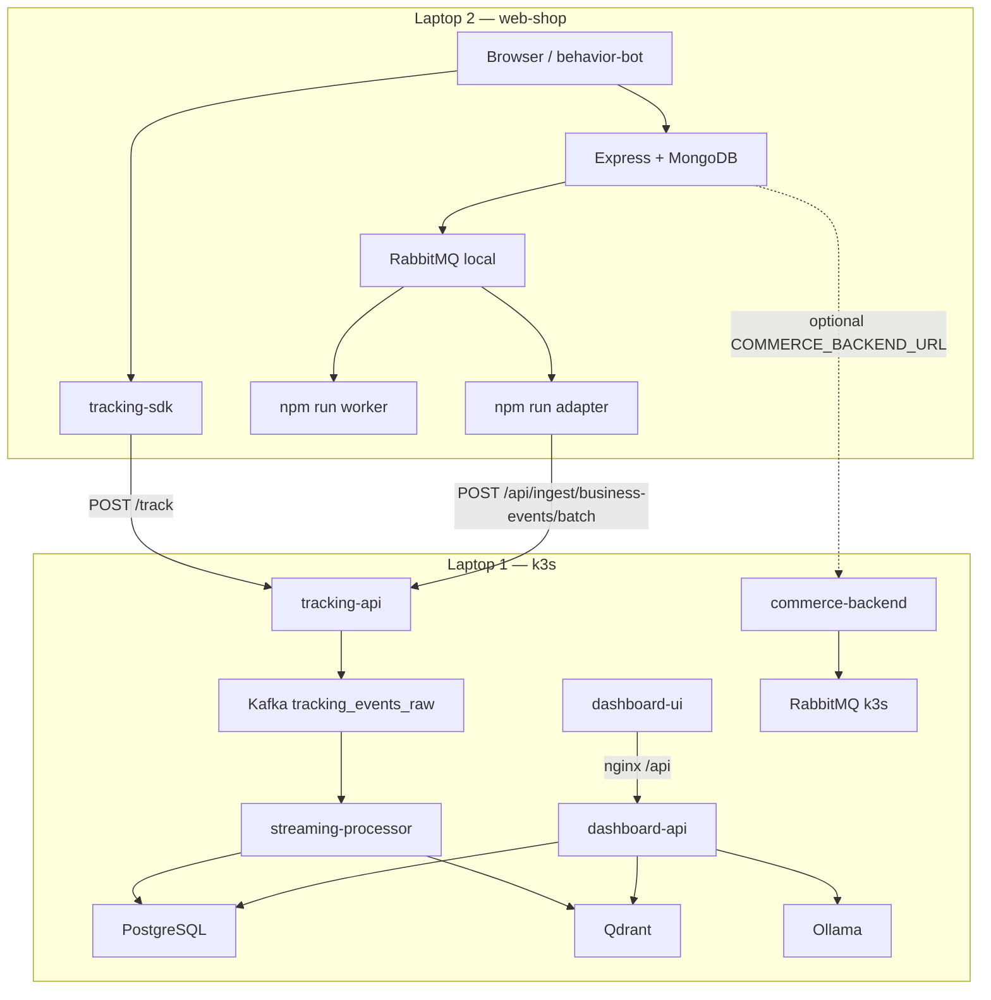

# Tech stack & luồng chạy

Tổng hợp **công nghệ**, **vai trò**, và **luồng runtime** của toàn project (repo gốc + submodule `clients/web-shop`).

**Liên quan:** [RUNTIME.md](RUNTIME.md) (deploy, port, CI/CD) · [REPO_MAP.md](REPO_MAP.md) (path) · [SPEC.md](SPEC.md) (spec) · [API.md](API.md) (REST)

---

## 1. Mục tiêu hệ thống

Refactor pipeline demo → **tracking realtime** cho website TMĐT:

| Nhóm dữ liệu | Nguồn | Đích cuối |
|--------------|-------|-----------|
| **Behavior** | Browser SDK | Funnel, sản phẩm, banner, search |
| **Commerce** | Backend + RabbitMQ | Doanh thu, đơn hàng, purchase |
| **Analytics** | Kafka + streaming | Postgres KPI |
| **AI chat** | Postgres + Qdrant + Ollama | Dashboard `/shop/chat` |

---

## 2. Triển khai vật lý (2 laptop)

```text
┌────────────────────────────── Laptop 2 (Windows) ──────────────────────────────┐
│  clients/web-shop                                                             │
│    • Frontend HTML/CSS/JS + tracking-sdk                                      │
│    • Express API + MongoDB (shop: SP, giỏ, đơn, user)                         │
│    • RabbitMQ local + worker + tracking-adapter                               │
│    • behavior-bot (Playwright) — tuỳ chọn                                     │
└───────────────────────────────┬──────────────────────────────────────────────┘
                                │ HTTP (Tailscale / WSL_IP)
                                ▼
┌────────────────────────────── Laptop 1 (WSL2 + k3s namespace realtime) ──────┐
│  tracking-api · commerce-backend · Kafka · streaming-processor               │
│  Postgres · Qdrant · RabbitMQ · Ollama                                       │
│  dashboard-api · dashboard-ui                                                │
└──────────────────────────────────────────────────────────────────────────────┘
```

| Máy | Lệnh deploy / chạy |
|-----|-------------------|
| **Lap1** | `k3s kubectl apply -k infra/k8s/sprint3` |
| **Lap2** | `cd clients/web-shop` → `npm run dev` + `worker` + `adapter` |

---

## 3. Luồng chạy tổng thể

### 3.1. Sơ đồ end-to-end



### 3.2. Luồng A — Behavior tracking (SDK)

```text
[1] User thao tác web-shop (Lap2)
      ↓
[2] tracking-sdk capture event
      page_view | product_view | product_click | search | filter_apply
      scroll_depth | banner_impression | banner_click
      ↓
[3] POST /track (web-shop backend hoặc forward)
      → TRACKING_FORWARD_URL = http://<WSL_IP>:31000/track
      ↓
[4] tracking-api (Lap1)
      validate → enrich → KafkaJS publish
      ↓
[5] Kafka topic: tracking_events_raw
      ↓
[6] streaming-processor
      parser → validator → cleaner
      → INSERT tracking_events_clean
      → aggregator (window 1 phút, flush mỗi FLUSH_INTERVAL_SEC)
      → UPSERT KPI tables + insight_generator → Qdrant
      ↓
[7] dashboard-api đọc Postgres
      GET /api/overview, /funnel, /products, /banners, /revenue…
      ↓
[8] dashboard-ui (React) + SSE /api/events/stream (~2s)
```

**Độ trễ KPI behavior:** thường **~5–10s** (Kafka + flush + SSE), không chờ hết phút lịch.

### 3.3. Luồng B — Commerce (RabbitMQ → analytics)

```text
[1] Checkout: POST /api/orders (web-shop Lap2 hoặc commerce-backend k3s :30330)
      ↓
[2] Publish RabbitMQ exchange ecommerce.events (topic)
      order.created → worker queue webdemo.order-processing
      ↓
[3] npm run worker (Lap2)
      pending → inventory.reserved → payment.succeeded → order.completed
      (publish thêm event lên cùng exchange)
      ↓
[4] npm run adapter (Lap2)
      consume tracking.adapter.business-events (order.*, payment.*, inventory.*)
      validate → normalize → batch
      ↓
[5] POST http://<WSL_IP>:31000/api/ingest/business-events/batch
      Header: TRACKING_INGEST_API_KEY (trùng k3s secret)
      ↓
[6] tracking-api → businessEventToTracking → Kafka (cùng topic raw)
      ↓
[7] streaming-processor (giống Luồng A)
      order.completed → purchase_succeeded, revenue metadata
      ↓
[8] Dashboard Revenue / Overview cập nhật qua Postgres + SSE
```

**Quy tắc quan trọng**

- tracking-api **không** consume RabbitMQ — chỉ adapter gọi HTTPS ingest.
- Commerce-connector trong k3s **đã bỏ**; adapter chạy trên Lap2 (`npm run adapter`).
- Thiếu **worker** → ít `order.completed` → doanh thu trống.
- Thiếu **adapter** → RabbitMQ có message nhưng Lap1 không nhận.

### 3.4. Luồng C — Chatbot RAG

```text
User → /shop/chat → POST /api/chat (JWT)
      ↓
dashboard-api/src/lib/chat/
      scope.guard → planner (intent + minutes)
      → data-loader (SQL Postgres — số thật)
      → rag-filters (search Qdrant pipeline_insights)
      → analyst-report + respond (template grounded)
      → polish (Ollama qwen2.5:3b, tuỳ chọn, cap `POLISH_TIMEOUT_CAP_MS` = 55s)
      → output.guard → JSON answer + action cards
```

| Thành phần | Vai trò |
|------------|---------|
| **PostgreSQL** | Con số chính xác (SUM, COUNT, funnel…) |
| **Qdrant** | Insight text / ngữ cảnh semantic (RAG) |
| **Ollama** | Diễn đạt tự nhiên; down → vẫn trả template |

Embedding: hash-based 384-d (`embed.py` / `embed.js`) — không dùng OpenAI API.

### 3.5. Luồng deploy & vận hành (Lap1)

```text
git clone + git submodule update --init
      ↓
cp infra/.env.example infra/.env
      ↓
WSL: bash infra/k8s/install-k3s-wsl.sh          (lần đầu)
      ↓
k3s kubectl create namespace realtime
k3s kubectl apply secret app-secrets
      ↓
bash infra/k8s/import-images.sh
k3s kubectl apply -k infra/k8s/sprint3
      ↓
ollama pull qwen2.5:3b                            (lần đầu)
      ↓
Lap2: clients/web-shop/.env → WSL_IP / lap1
npm install && npm run seed
npm run dev | worker | adapter
```

Sau đổi code: `bash infra/k8s/rebuild-all-dev-images.sh` + restart pod liên quan.

---

## 4. Công nghệ theo tầng

### 4.1. Hạ tầng & DevOps

| Công nghệ | Path | Công dụng |
|-----------|------|-----------|
| **k3s** | `infra/k8s/` | Orchestrator backend Lap1 |
| **Kustomize** | `sprint1` → `sprint2` → **sprint3** | Manifest deploy theo phase |
| **Docker** | `*/Dockerfile` | Build image dev |
| **WSL2 Ubuntu** | Lap1 | Host k3s |
| **Git submodule** | `clients/web-shop` | Web demo repo riêng |
| **Tailscale / Headscale** | tuỳ chọn | Lap1 ↔ Lap2 qua hostname `lap1` |
| **Node.js 20** | Docker base | Runtime API services |
| **Python 3** | streaming-processor | Consumer pipeline |

### 4.2. Message broker

| Công nghệ | Image / lib | Chạy ở | Công dụng |
|-----------|-------------|--------|-----------|
| **Apache Kafka 3.7** | `apache/kafka:3.7.0` | k3s | Bus analytics — `tracking_events_raw` |
| **KafkaJS** | tracking-api | Lap1 | Producer |
| **kafka-python** | streaming-processor | Lap1 | Consumer |
| **RabbitMQ 3.13** | `rabbitmq:3.13-management-alpine` | k3s + Lap2 local | Bus commerce — `ecommerce.events` |
| **amqplib** | commerce-backend, web-shop | Lap1 + Lap2 | Publish/consume |

**Kafka vs RabbitMQ**

| | Kafka | RabbitMQ |
|---|-------|----------|
| Luồng | SDK + ingest → pipeline | Checkout → worker → adapter |
| Đặc tính | Event log, replay, aggregate | Task queue, routing, tách web/tracking |

### 4.3. Database & lưu trữ

| Công nghệ | Chạy ở | Công dụng |
|-----------|--------|-----------|
| **PostgreSQL 15** | k3s Lap1 | Event sạch, KPI/phút, dashboard users |
| **pg / psycopg2** | dashboard-api, streaming-processor | Read/write analytics |
| **MongoDB + Mongoose** | **chỉ web-shop Lap2** | SP, giỏ, đơn demo, user shop |
| **Qdrant v1.12.5** | k3s Lap1 | Vector insight — `pipeline_insights` |
| **PVC k8s** | postgres, kafka, qdrant, ollama | Persist qua restart pod |

**Bảng Postgres chính** (`infra/postgres/001_tracking_schema.sql`)

| Bảng | Dashboard |
|------|-----------|
| `tracking_events_clean` | Recent events, banner fallback |
| `tracking_kpi_1m` | Overview, revenue tổng |
| `product_kpi_1m` | Products |
| `product_revenue_kpi_1m` | Bảng SKU + doanh thu |
| `banner_kpi_1m` | Banners |
| `dashboard_users` | Login Admin / Analyst |

**Không dùng:** Redis, Elasticsearch, Mongo trên pipeline Lap1.

### 4.4. AI

| Công nghệ | Công dụng |
|-----------|-----------|
| **Ollama** (`ollama/ollama:latest`) | LLM in-cluster |
| **qwen2.5:3b** | Polish chat |
| **RAG** | Postgres (số) + Qdrant (context) + Ollama (ngôn ngữ) |

---

## 5. Services & clients — chi tiết

### 5.1. Laptop 1 — k3s (`namespace realtime`)

| Pod / service | Stack | Path | NodePort | Vai trò |
|---------------|-------|------|----------|---------|
| **tracking-api** | Node, Express, KafkaJS | `services/tracking-api/` | **31000** | Ingest `/track`, business batch → Kafka |
| **commerce-backend** | Node, Express, amqplib | `services/commerce-backend/` | **30330** | API đơn stand-in → RabbitMQ |
| **streaming-processor** | Python, kafka-python, psycopg2 | `services/streaming-processor/` | — | Kafka → Postgres + Qdrant |
| **dashboard-api** | Node, Express, pg, JWT | `services/dashboard-api/` | **32000** | Analytics API + chat + SSE |
| **dashboard-ui** | React, Vite, nginx | `clients/dashboard/` | **30809** | UI + proxy `/api` |
| **kafka** | apache/kafka:3.7.0 | `infra/k8s/data/kafka/` | — | Message bus |
| **postgres** | postgres:15-alpine | `infra/k8s/data/postgres/` | — | OLTP analytics |
| **qdrant** | qdrant/qdrant:v1.12.5 | `infra/k8s/data/qdrant/` | — | Vector RAG |
| **rabbitmq** | rabbitmq:3.13-management | `infra/k8s/data/rabbitmq/` | — | Commerce bus (k3s path) |
| **ollama** | ollama/ollama:latest | `infra/k8s/apps/ollama/` | — | LLM chat |

**Streaming pipeline modules:** `parser` → `validator` → `cleaner` → `aggregator` → `sink_postgres` → `insight_generator`

**Env quan trọng:** `KAFKA_TOPIC_RAW=tracking_events_raw`, `FLUSH_INTERVAL_SEC=5`

### 5.2. Laptop 2 — web-shop (`clients/web-shop`)

| Khối | Stack | Script | Vai trò |
|------|-------|--------|---------|
| Frontend | HTML, CSS, JS | — | UI TMĐT |
| **tracking-sdk** | ES modules, fetch | — | Behavior events |
| Backend | Express, Mongoose, JWT | `npm run dev` | API shop + forward `/track` |
| Worker | amqplib | `npm run worker` | Xử lý đơn async |
| Adapter | amqplib, axios | `npm run adapter` | RabbitMQ → ingest Lap1 |
| Behavior bot | Playwright, Edge | `npm run bot` | Giả lập user |
| MongoDB | local / Docker | `npm run seed` | Catalog 500 SP, cart, orders |

**`.env` Lap2 (tóm tắt):**

```env
TRACKING_FORWARD_URL=http://<WSL_IP hoặc lap1>:31000/track
TRACKING_INGEST_URL=http://<WSL_IP hoặc lap1>:31000
TRACKING_INGEST_API_KEY=...   # trùng k3s secret
RABBITMQ_URL=amqp://...@localhost:5672
```

### 5.3. SDK repo gốc

| Path | Ghi chú |
|------|---------|
| `sdk/browser-behavior-sdk/` | SDK độc lập; copy/wrap vào web-shop |
| `banner-tracking.js` | Banner impression/click |

### 5.4. Chưa đầy đủ / shell

| Path | Status |
|------|--------|
| `bot-simulator/` | Shell — web-shop đã có `behavior-bot/` |
| API Gateway nginx tập trung | Spec TBD |
| Spark | Tên cũ — đã thay **Python** streaming-processor |

---

## 6. Bảng master — công nghệ thường gặp

| Công nghệ | Có? | Ở đâu | Làm gì |
|-----------|-----|-------|--------|
| **SDK** | Có | `sdk/`, web-shop `tracking-sdk/` | Track browser |
| **Express** | Có | tracking-api, dashboard-api, commerce-backend, web-shop | HTTP API |
| **MongoDB** | Có | **web-shop Lap2 only** | DB shop |
| **PostgreSQL** | Có | k3s Lap1 | Analytics + auth |
| **Kafka** | Có | k3s Lap1 | Stream analytics |
| **RabbitMQ** | Có | k3s + Lap2 | Commerce events |
| **Qdrant** | Có | k3s Lap1 | RAG insight |
| **Ollama** | Có | k3s Lap1 | Chat polish |
| **React + Vite** | Có | `clients/dashboard` | Dashboard UI |
| **Recharts** | Có | dashboard | Biểu đồ |
| **nginx** | Có | dashboard-ui image | Static + reverse proxy |
| **Playwright** | Có | web-shop behavior-bot | Bot traffic |
| **Redis** | Không | — | — |
| **Spark** | Không | — | Thay bằng Python processor |

---

## 7. Design pattern

| Pattern | Áp dụng |
|---------|---------|
| Event-Driven Architecture | SDK, RabbitMQ, Kafka, streaming |
| Pub/Sub | Kafka topic, RabbitMQ exchange |
| Pipeline | streaming-processor modules |
| Adapter | web-shop tracking-adapter |
| Controller–Service–Repository | API services |
| Component-Based UI | React dashboard |
| RAG | Chat: SQL + Qdrant + Ollama |
| SSE | KPI realtime dashboard |

---

## 8. URL & port (từ Windows / Lap2)

`WSL_IP` = `hostname -I` trên WSL Lap1.

| Dịch vụ | URL |
|---------|-----|
| Dashboard UI | `http://<WSL_IP>:30809` |
| Dashboard API | `http://<WSL_IP>:32000` |
| Tracking API | `http://<WSL_IP>:31000` |
| Commerce backend | `http://<WSL_IP>:30330` |
| Web-shop dev | `http://localhost:3000` (Lap2) |

Login dashboard: `admin@gmail.com` / `admin@123` (Admin).

Chi tiết port: [RUNTIME.md §5](RUNTIME.md#5-url--port).

---

## 9. Checklist chạy demo đầy đủ

**Lap1 (WSL)**

- [ ] k3s + sprint3 pods Running
- [ ] Ollama model `qwen2.5:3b` pulled
- [ ] Secret `TRACKING_INGEST_API_KEY` khớp Lap2

**Lap2 (Windows)**

- [ ] MongoDB + RabbitMQ local
- [ ] `npm run seed` (web-shop)
- [ ] `npm run dev` + `worker` + `adapter`
- [ ] `.env` trỏ đúng `WSL_IP` / `lap1`

**Kiểm tra nhanh**

```bash
# Behavior
curl -X POST "http://<WSL_IP>:31000/track" -H "Content-Type: application/json" \
  -d '{"event_type":"page_view","anonymous_id":"t1","session_id":"s1","page_url":"/"}'

# Commerce → RabbitMQ → adapter → ingest (sau khi worker + adapter chạy)
curl -X POST "http://<WSL_IP>:30330/api/orders" -H "Content-Type: application/json" \
  -d '{"anonymousId":"a1","sessionId":"s1","paymentMethod":"cod","items":[{"productId":"P001","name":"Demo","price":100000,"quantity":1}]}'
```

---

## 10. Tài liệu liên quan

| File | Nội dung |
|------|----------|
| [README.md](README.md) | Mục lục doc |
| [RUNTIME.md](RUNTIME.md) | Deploy, port, Postgres, CI/CD, Headlamp |
| [REPO_MAP.md](REPO_MAP.md) | Spec → path code |
| [SPEC.md](SPEC.md) | Event schema, kiến trúc gốc |
| [API.md](API.md) | REST + Swagger |
| [BAO_CAO_DU_AN.md](BAO_CAO_DU_AN.md) | Báo cáo / luận văn |
| [RabbitMQ docx](RabbitMQ_Adapter_Integration_Standard_Windows_K8s_Tailscale.docx) | Adapter standard |
| [clients/web-shop/README.md](../clients/web-shop/README.md) | Shop Lap2 (submodule) |

**Swagger localhost:** `cd clients/api-docs && npm run dev` → `:5190` — proxy `/proxy/dashboard|tracking|commerce`, xem [API.md](API.md).
